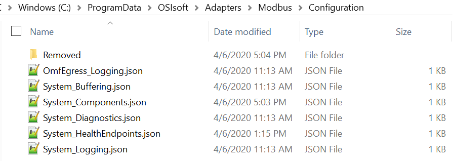

# Delete an adapter component

When you remove an adapter component, the configuration and log files are saved into a sub-directory in case they are needed later. Any associated types, streams, and data remain on the respective endpoints.

Complete the following steps to delete an adapter component:

1. Start any of the [Configuration tools](xref:ConfigurationTools) capable of making HTTP requests.

2. Run a `DELETE` command to the following endpoint: `http://localhost:5590/api/v1/configuration/system/components/<ComponentId>`

    **Note:** You must make an empty `DELETE` command  against the `Id` of the component you want to delete. <br> `5590` is the default port number. If you selected a different port number, replace it with that value.

      Example using `curl` :

    **Delete OpcUa1 adapter component**

      ```bash
      curl -X DELETE "http://localhost:5590/api/v1/configuration/system/components/OpcUa1"
      ```

## File relocation

All configuration and log files are renamed and moved. The files are renamed according to the timestamp of removal, for example `FileName.json_removed_yyyy-MM-dd--hh-mm-ss`.

Configuration files will be moved to the following location:

   **Windows:** `%programdata%\OSIsoft\Adapters\AdapterName\AdapterName\Configuration\Removed`

   **Linux:** `/usr/share/OSIsoft/Adapters/AdapterName/AdapterName/Configuration/Removed`

Log files will be moved to the following location:

   **Windows:** `%programdata%\OSIsoft\Adapters\AdapterName\AdapterName\Logs\Removed`

   **Linux:** `/usr/share/OSIsoft/Adapters/AdapterName/AdapterName/Logs/Removed`

In the following example, one Modbus adapter service is installed on a particular Windows node with the name `ModbusService1`. A Modbus component with the name `ModbusDeviceX` was added and configured to this Modbus adapter and later removed. Linux follows a similar behavior. This is the resulting relocation and renaming scheme after deletion:




## REST URLs

| Relative URL                                              | HTTP verb | Action               |
|-----------------------------------------------------------|-----------|----------------------|
| api/v1/configuration/system/components/*ComponentId*      | DELETE       | Deletes specified component |

**Note:** Replace `ComponentId` with the `Id` of the component that you want to delete.
