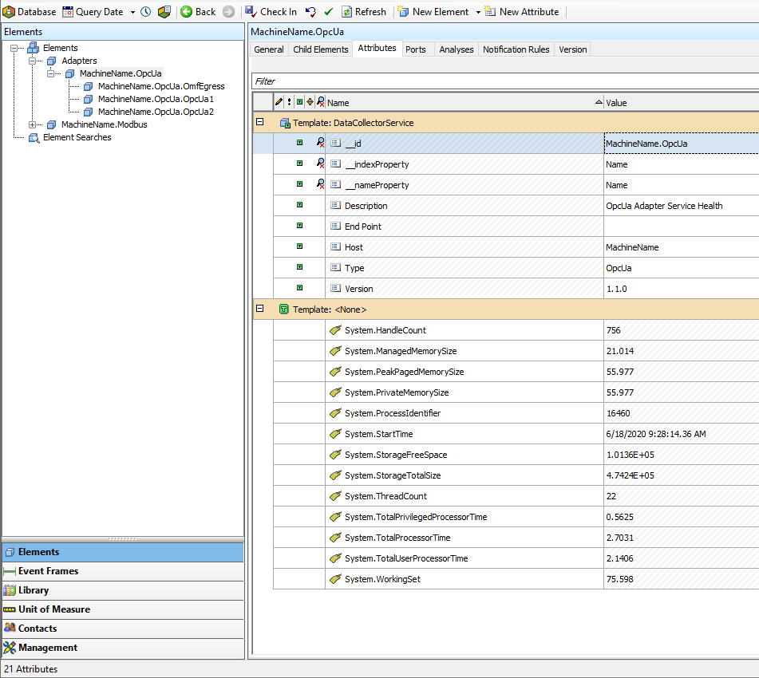

# Adapter diagnostics

The adapter and its components produce different kinds of diagnostics data that is sent to all health endpoints. The `System_Diagnostics.json` file contains a flag that determines whether diagnostics are enabled. You can change this at runtime through REST calls or the EdgeCmd utility. Diagnostics data are collected by default.

To egress diagnostics related data, you have to configure an adapter health endpoint first. See [Health endpoint configuration](xref:HealthEndpointConfiguration).

## Available diagnostics data

Every minute, dynamic data is sent to configured health endpoints.

The following diagnostics data are available:

- [System](xref:System)
- [Stream count](xref:StreamCount)
- [IO rate](xref:IORate)
- [Error rate](xref:ErrorRate)

## AF structure

After running diagnostics with a health endpoint configured to a PI server, you can use PI System Explorer to view the diagnostics for a given adapter. The element hierarchy is shown in the following image.

- The **Elements** root contains a link to an **Adapters** node. This is the root node for all adapter instances.
- Below **Adapters**, you will find one or more adapter nodes. Each node's title is defined by the node's corresponding computer name and service name in this format: `{ComputerName}.{ServiceName}`. For example, in the following image, **MachineName** is the computer name and **OpcUa** is the service name.
- To see the **System.Diagnostics** values, click on an adapter node and set the tab to **Attributes**. Example values are shown in the image.
