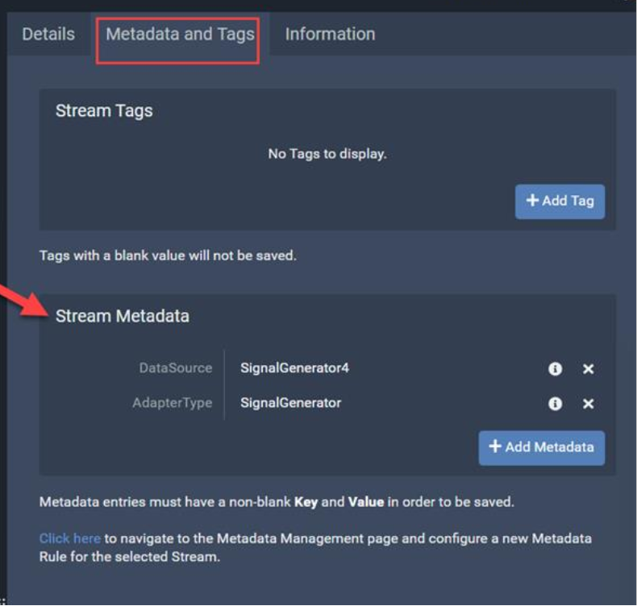

# Adapter metadata

If the option to send metadata is set to `true` in the [General configuration](xref:GeneralConfiguration), adapter streams created by the ingress components include the following metadata:

```code
  Datasource: {ComponentId}
  AdapterType: {ComponentType}
```

`ComponentId` corresponds to the adapter components' data source configured in the [Components configuration](xref:SystemComponentsConfiguration). `ComponentType` corresponds to the adapter type. For example, Modbus or OpcUa.

## Metadata for health and diagnostics streams

If you configure a health endpoint and enable metadata, they are included in the health streams ([Device status](xref:DeviceStatus) and [Next health message expected](xref:NextHealthMessageExpected)) together with `ComponentId` and `ComponentType`.

If you enable diagnostics in [General configuration](xref:GeneralConfiguration), metadata are included in the diagnostics streams ([Stream count](xref:StreamCount), [IO rate](xref:IORate), [Error rate](xref:ErrorRate)) together with `ComponentId` and `ComponentType`.

The adapter may also send its own stream metadata not including health and diagnostics streams. For more information about what custom metadata is included in each stream, see the user guide for your adapter.

**Note:**

- Metadata is only sent for streams created by the ingress components.
- Currently, the only endpoint that persists sent metadata is OCS (OSIsoft Cloud Services).

||
|:--:|
|_Metadata in OCS_|
